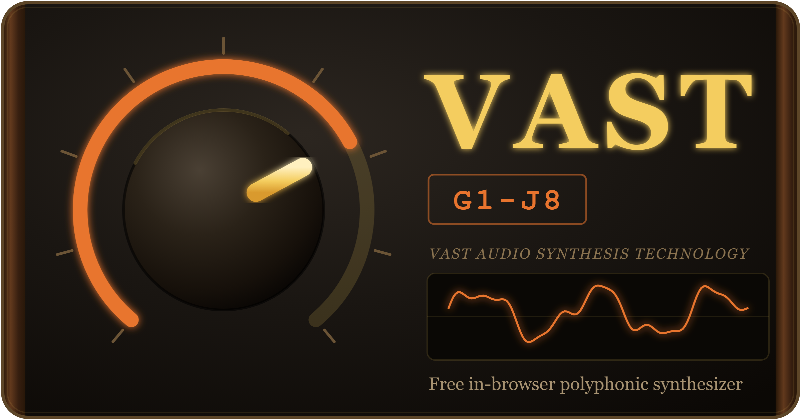

# WebSynth — VAST G1-J5

A browser-based polyphonic subtractive synthesizer — with a step-sequenced
drum machine and multi-track sampler — built on the Web Audio API.
Vanilla TypeScript + Vite, zero runtime dependencies.

<p align="center">
  <a href="https://vast.status201.com/">
    
  </a>
</p>

<p align="center">
  <strong><a href="https://vast.status201.com/">▶ Launch VAST G1-J5 in your browser →</a></strong><br>
  Free. No install, no signup — open it and play.
</p>

## Features

- **8-voice polyphony** with mono/poly switching and glide
- **Dual oscillator** (sine/triangle/saw/square) + noise, per-osc octave/detune/level
- **Sub oscillator** (one/two octaves down) for analogue weight
- **Unison** voice-stacking with detune spread (fat supersaw)
- **Oscillator drift / "Age"** — subtle analogue tuning instability
- **Vintage glide modes**: off / always / legato (portamento)
- **Moog-style 4-pole ladder filter** with resonance and drive, implemented as a custom AudioWorklet (cutoff modulated in semitones)
- **Two ADSR envelopes** (amp + filter), filter-envelope amount in semitones
- **LFO** routable to cutoff, pitch, amp, or pulse width
- **FX chain**: distortion → wah → phaser → delay → reverb (each independently bypassable)
- **Bus compressors** (custom AudioWorklet, with gain-reduction meters): a 1176-style FET compressor on the drum bus (microsecond attacks, program-dependent release, "all buttons in" mode) and an SSL-G-style VCA "glue" compressor on the master bus (soft knee, auto-release)
- **Transport**: clock, arpeggiator, 16-step note sequencer, 8-track drum machine, and 8-slot multi-track sampler
- **Per-step settings** on all three machines, visualized on the step buttons: velocity, gate (chokes a drum/sampler hit early when shortened), probability, ratchet (1–4 sub-hits), and tie (seq: legato/slide; drums/sampler: let the last ratchet hit ring)
- **Pattern banks**: the sequencer, drum machine, and sampler each have 4 banks (A/B/C/D), independently copyable and chainable
- **Sampler sounds**: each of the 8 slots plays a one-shot sample. Load a WAV/MP3, or **record from your microphone and edit in-app** — crop, low/hi-pass, octave up/down, reverse, normalize, fade in/out, boost — then save WAV/MP3 or drop it straight into a slot; any loaded slot can be re-opened (✎) to edit again
- **Song chains**: build an arrangement (e.g. `A A B A C A A D`) per machine — independent seq, drum, and sampler lanes
- **Live DJ FX**: momentary Fill, Stutter/beat-repeat (1 / 1/8 / 1/4), Filter Drop, Tape Stop, and a manual bipolar DJ Filter sweep (LP ← → HP)
- **Songs**: save/load complete songs (all settings + every seq/drum/sampler bank + all three chains) as portable `.json` files and browser slots — sampler *audio* isn't embedded, so its files are re-loaded after import; built-in demos **Apex Twin**, **Zombie Nation**, and **I Feel Love** (drop any `.json` SongFile into `src/state/demos/` to add a demo at build time)
- **Presets**: factory bank (basic, bass, lead, pad, pluck, wobble) + user presets saved to `localStorage`
- **Input**: on-screen keyboard, computer-keyboard mapping, and Web MIDI
- Oscilloscope / spectrum display, pitch-bend and mod wheels

## Running

```bash
npm install
npm run dev      # vite dev server, --host (open the printed URL)
npm run build    # tsc typecheck + vite production build to dist/
npm run preview  # serve the production build
npm run typecheck
npm test         # vitest run — unit tests (jsdom)
npm run e2e      # playwright run — browser end-to-end tests (Chromium)
npm run release  # cut a versioned release (see Releasing below)
```

Audio starts behind a **"Tap to start"** overlay — browsers require a user
gesture before an `AudioContext` may produce sound.

## Releasing

`npm run release -- <version|major|minor|patch>` bumps `package.json`, promotes
the CHANGELOG `[Unreleased]` section, builds the app, and zips `dist/` into
`dist-v<version>.zip` — then **prints** the `git` and `gh release create`
commands to publish (it never touches git/GitHub itself). Use `--dry-run` to
preview, `--yes` to skip the prompt, `--skip-build` to skip the build + zip.
Attaching the zip needs the [`gh` CLI](https://cli.github.com/) authenticated.
See **[DEPLOYMENT.md](DEPLOYMENT.md)** for the full flow and how to deploy the
built `dist/`.

## Controls

- **Computer keyboard**: `z s x d c v g b h n j m ,` = lower octave,
  `q 2 w 3 e r 5 t 6 y 7 u i` = upper octave
- **Arrow Left/Right**: shift keyboard octave
- **`.` / `/`**: pitch bend up / down (springs back on release)
- **Space**: transport play / stop
- **F** (hold): drum fill
- **Esc**: panic (all notes off)

## Project layout

```
src/
  main.ts            boot: create Engine + ParamBus, mount UI, wire input
  audio/             AudioContext graph
    engine.ts        AudioContext owner: graph wiring, param subscriptions, transport
    polyphony.ts     voice pool + note allocation (poly/mono, unison, glide, drift)
    lane-mixer.ts    Song-tab mute / solo / volume across seq / drum / sampler
    voice.ts         one voice: 2 osc + noise → ladder filter → amp
    oscillator.ts, envelope.ts, lfo.ts, midi.ts
    ladder-filter/   AudioWorklet wrapper (worklet in public/worklets/)
    compressor/      AudioWorklet wrapper for the 1176/SSL bus compressor
    effects/         distortion, wah, phaser, delay, reverb, compressor
    drums/           drum synthesis
    transport/       clock, arpeggiator, sequencer, drum-machine, sampler,
                     arrangement (chain lanes), performance (live DJ FX)
    recorder/        mic capture, pure sample DSP, WAV/MP3 encode,
                     AudioWorklet sink (song export + record-a-sound)
  state/
    params.ts        ParamBus + all parameter definitions
    patterns.ts      PatternStore (seq / drum / sampler banks)
    preset.ts        factory bank + localStorage persistence
    song.ts          full-song save/load + demo songs
    demos/           drop-in *.json SongFiles, auto-loaded at build time
  ui/                hand-built DOM components and panels (incl. song-panel:
                     chains, DJ FX, song I/O). studio-api.ts is the UI's narrow
                     view of the Engine (see specs ADR-009)
  styles/            Global CSS: base.css (reset), theme.css (custom properties), layout.css (.app grid + responsive)
  ui/styles/         CSS Modules (*.module.css — component/panel-scoped, imported by components)
public/worklets/     ladder-filter.js, compressor.js, recorder.js (audio thread)
e2e/                 Playwright end-to-end specs (+ playwright.config.ts)
```
