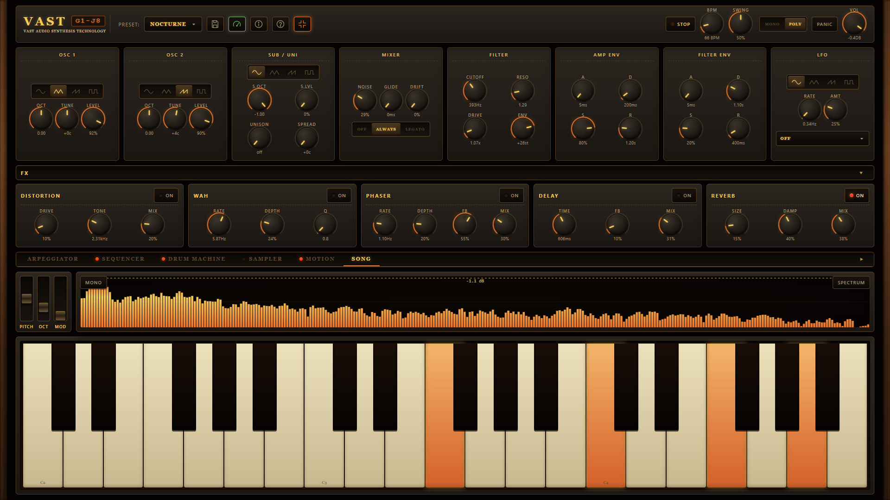
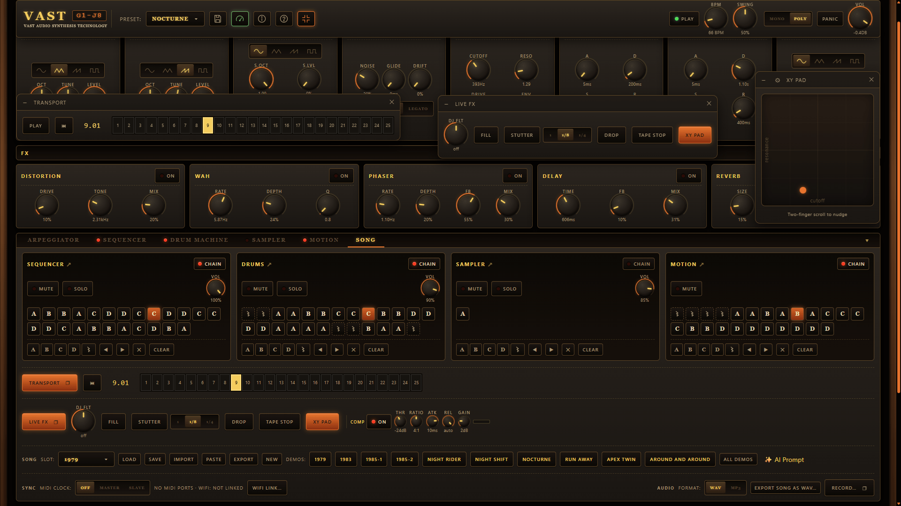
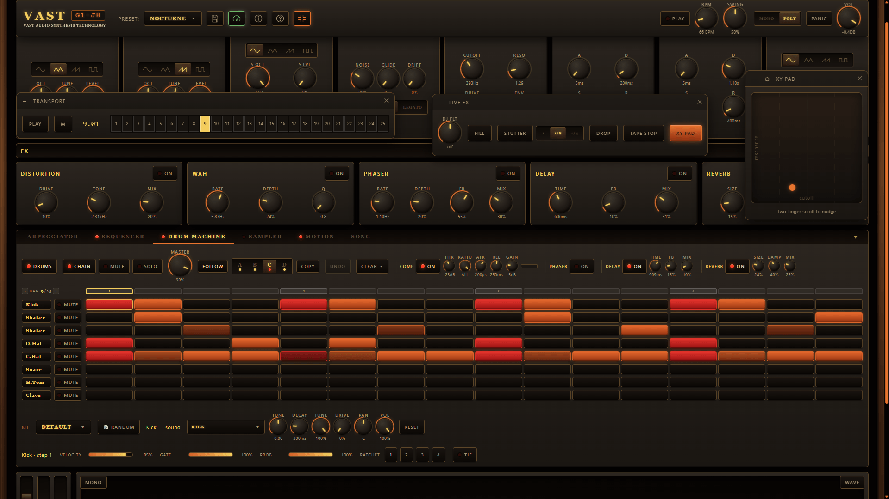

# WebSynth — VAST G1-J8

An open source browser-based polyphonic subtractive synthesizer — with a step-sequenced
drum machine and multi-track sampler — built on the Web Audio API.
Vanilla TypeScript + Vite, zero runtime dependencies.

<p align="center">
  <a href="https://vast.status201.com/">
    
  </a>
</p>

<p align="center">
  <strong><a href="https://vast.status201.com/">▶ Launch VAST G1-J8 in your browser →</a></strong><br>
  Free, as in Free Speech <em>and</em> Free Beer.<br>
  No install, no signup — open it and play.
</p>

<p align="center">
  <a href="https://vast.status201.com/">
    
  </a>
</p>

<p align="center">
  Make songs (arrangements) out of your sequencer, drum/motion machines and sampler lanes.<br>
  Share, save and load them using JSON files and zip project files when using sampler audio.<br>
  Or export as WAV/MP3.
</p>


<p align="center">
  <a href="https://vast.status201.com/">
    
  </a>
</p>

## Features

- **8-voice polyphony** with mono/poly switching and glide
- **Dual oscillator** (sine/triangle/saw/square) + noise, per-osc octave/detune/level, with **pulse width** on the square wave (band-limited at every width, so it never aliases)
- **Sub oscillator** (one/two octaves down) for analogue weight
- **Unison** voice-stacking with detune spread (fat supersaw)
- **Oscillator drift / "Age"** — subtle analogue tuning instability
- **Vintage glide modes**: off / always / legato (portamento)
- **Two filter models**, switchable on the same patch and level-matched so the switch is a change of character, not of volume — both custom AudioWorklets with cutoff modulated in semitones:
  - **LADDER** — Moog-style 4-pole with resonance and drive, saturating at every stage. Warm and growly; raising resonance trades bass for the resonant peak
  - **POLY** — 4-pole with clean stages and the saturation moved into the resonance itself. Glassy and open, and it **keeps its low end** however far you push resonance (the Prophet-600 trick: the resonance compensation is a pre-gain on the loop input). A **SHAPE** knob morphs it through LP24 → LP12 → BP12 → HP24, so the synth finally has a band-pass and a high-pass — and SHAPE is an LFO/XY/motion destination, so the filter *type* can sweep
- **Filter key tracking** — the note you play raises the cutoff, so timbre stays consistent up the keyboard (and a self-oscillating filter becomes playable as a pitched voice)
- **Two ADSR envelopes** (amp + filter), filter-envelope amount in semitones
- **LFO** routable to cutoff, pitch, amp, pulse width (PWM), **stereo pan** — an auto-panner following the LFO's own rate, depth and waveform — or filter **shape**
- **Mod matrix**: eight routes, each sending one **source** — either LFO, an envelope, the mod wheel, velocity, the note played, or a sample-and-hold **random** — into one **destination**, at its own **bipolar** depth (past zero the route inverts). Two routes may share a destination and simply add, so the old "one LFO, one destination" limit is gone. It reaches `filter.resonance`, which nothing could modulate before. Routing lives in the **audio graph**, summed natively at audio rate, so a route costs one gain node and *no* per-frame CPU — which is also why the destination list is short and deliberate: for anything else (effect mixes, levels, tempo) the Motion sequencer and XY Pad remain the tools. Opens from **MOD** in the Song tab's Live FX row, in a movable window you can leave open while you play. A modulated knob on the synth panels grows an inner arc showing the range modulation can reach — **green** for up, **yellow** for inverted — and a mod-wheel route also shows a live tick, so you can see where the wheel currently has it without opening the window
- **FX chain**: distortion → wah → phaser → delay → reverb → duck (each independently bypassable)
- **Sidechain ducking**: the pumping that dance music is built on. The **Duck** panel pulls the synth down out of the way each time a drum hits and lets it swell back — pick which drum keys it will duck (**Kick** is the classic, or **Any**), how far it pulls, how fast it gets out of the way and how long it takes to return. It follows the drum *pattern* rather than a fixed rate, so ratchets, ghost notes and fills all come along, and it only pumps while that drum is actually playing — mute the lane and the pumping stops with it. Sitting last in the chain, it ducks the reverb tail too, which is the sound. The sampler channel has its own, so a loop can breathe around the kick the same way. There is no detector and no threshold to dial: the trigger comes from the drum machine's own scheduling, so it costs no audio-thread processing at all
- **Tempo lock**: every rate and delay-time knob — the wah, the phaser, the delay, both LFOs, and the phaser and delay on the drum and sampler channels — carries a small **note glyph** beside its label. Tap it and the knob *becomes* the note division it is running at (`1/8`, `1/8 D`, `1/4 T`), with the real Hz or milliseconds still shown underneath, so the musical value and the actual one are visible at once. A locked effect then follows the song: change the BPM — or slave the transport to an incoming MIDI clock — and the delay stays on the beat instead of drifting. Engaging the lock picks the division nearest where the knob already sits, so switching it on never jumps the sound, and unlocking returns the knob to exactly the value it was holding. Divisions the current tempo puts out of a knob's reach are greyed rather than hidden. It costs no panel space at all: the division sits in the dial's own footprint
- **Bus compressors** (custom AudioWorklet, with gain-reduction meters): a 1176-style FET compressor on the drum bus (microsecond attacks, program-dependent release, "all buttons in" mode) and an SSL-G-style VCA "glue" compressor on the master bus (soft knee, auto-release)
- **Transport**: clock, arpeggiator, **4-track** 16-step note sequencer (chords and counter-lines; tracks 2–4 need poly voicing, and fold away when unused), 8-track drum machine, and 8-slot multi-track sampler
- **Time signatures & polyrhythm**: a **METER** control beside BPM puts the whole instrument in 3/4, 5/4, 2/4, 7/4, 5/8, 6/8, 7/8, 9/8 or 12/8 — every machine follows it at once, the step grids redraw to the bar's own length (3/4 draws twelve columns, not sixteen with four dead ones), the beat accents and the position ruler number the bar's real beats, and rendering, exporting and resampling all measure a bar the song's way. Each machine then has its own **LEN** and **RATE**: leave them on *BAR* and *1/16* and nothing changes, or set the drums to 12 steps under a 16-step bar and the two phase against each other, re-aligning every four bars — or give a lane a triplet rate and it plays three notes against the bar's two, inside the bar. A line beside the controls says which you have (`12 steps vs 4/4 — polyrhythm`), so it never reads as something broken. Swing follows each lane's own grid, so a slower lane swings *with* the hats instead of sitting straight against them. 5/4 and 7/4 are reached at eighth-note resolution, the grid being sixteen cells and a 5/4 bar twenty sixteenths. 4/4 is the default and no existing song changes
- **Key, scale & chord tools**: a **KEY** tab sets a root and a scale, and every note the instrument plays — sequencer, arpeggiator and keyboard alike — is snapped onto the nearest note of that key, so wrong notes stop being possible. It is a **live filter, not an edit**: your stored notes are untouched, so switching back to *chromatic* restores the pattern exactly (and `chromatic` is the default, so no existing sound, song or share link changes). Because the snap happens *after* an arrangement slot's transpose, a progression built from bar transposes now stays in key instead of drifting out of it. A two-octave keyboard map shows the key at a glance — root, chord tones, the rest of the scale, and the notes now out of play. **Chord memory** turns one held key into a diatonic triad/7th/sus4/power chord (the arpeggiator picks it up, so one finger drives a progression), and the Sequencer tab's **Chord ▾** writes a chord across all four tracks at the selected step — built by stacking scale degrees, so `ii` comes out minor and `vii°` diminished on its own — in a single Undo. **Snap** bakes the current key into the stored bank when you do want it permanent
- **Per-step settings** on the seq/drum/sampler machines, visualized on the step buttons: velocity, gate (chokes a drum/sampler hit early when shortened), probability, ratchet (1–4 sub-hits), tie (seq: legato/slide; drums/sampler: let the last ratchet hit ring), and **micro-timing** — nudge one hit off the grid, ±12 notches of 1/24 of a step (~5 ms each at 120 BPM), for a snare that lays back or hats that push. Unlike SWING, which moves every off-beat by the same amount, this is per step; the lit block slides inside its cell so the groove is visible on the grid. Half a step is the limit, which is exactly where a late hit and the early hit after it meet without ever crossing
- **Grid editing that gets out of the way**: tap a step to toggle it, **drag across the grid to paint** a whole run on or off in one swipe (starting on a lit step erases), and **press-and-hold** — or right-click — a step to select it for editing *without* switching it off. `Delete` clears the selected step, and every machine's **Clear ▾** wipes a bank or just one row — the selected sequencer track, drum track or sampler slot, or (on Motion, which has no selection cursor) whichever lanes currently hold steps — with a one-press Undo. A step you switch off keeps its note, velocity, gate and the rest, so toggling it back on restores it exactly
- **Pattern banks**: the sequencer, drum machine, sampler, and motion sequencer each have 4 banks (A/B/C/D), independently copyable and chainable
- **Sampler sounds**: each of the 8 slots plays a one-shot sample. Load a WAV/MP3, or **record from your microphone and edit in-app** — crop, low/hi-pass, octave up/down, reverse, normalize, fade in/out, boost — then save WAV/MP3 or drop it straight into a slot; any loaded slot can be re-opened (✎) to edit again
- **Resampling**: the Sequencer tab's **Import into sampler** renders the current seq bank through the live synth + FX into a sampler slot — a **bar-exact, seamlessly looping** capture (tails wrap into the loop start), so you can layer harmonies on top of the live synth without a second synth instance
- **Song chains**: build an arrangement (e.g. `A A B A C A A D`) per machine — independent seq, drum, sampler, and motion lanes, with an optional **rest** slot for an empty bar (a lane sits out without spending a bank); bank buttons append, and any bar can then be **dragged** to where it belongs. On the sequencer lane a bar can also carry a **transpose** (`A+5`) — shown in its own colour on the chip — so one bank becomes a whole progression
- **Live DJ FX**: momentary Fill, Stutter/beat-repeat (1 / 1/8 / 1/4), Filter Drop, Tape Stop, and a manual bipolar DJ Filter sweep (LP ← → HP)
- **XY Pad**: an assignable Kaoss-pad-style controller in a movable, non-modal window (open it from the Song tab's Live FX row and keep playing while you sweep). Its two axes each drive **any** parameter (defaults X = filter cutoff, Y = filter resonance) through the correct taper; drag the square — or two-finger scroll it — to sweep both at once, and on release they **spring back** to where they were, so it colours a moment without editing the patch. The axis assignment saves with the song
- **Motion sequencer**: step-recorded **parameter automation** — a 16-step × 4-bank grid of XY anchors that drives the XY Pad's two assigned params while the song plays. Each step is a mini XY pad (drag to set, double-click to clear) and a graph line traces the selected axis across the bar; **Slide** ramps smoothly between anchors (a one-bar filter sweep is just three anchors), **Step** jumps and holds (param-lock stabs) — and each lane picks its own, so one parameter can sweep while another steps. Each bank can drive its **own pair of params** (say, cutoff×resonance in A, delay time×mix in B), it has its own arrangement chain lane, and every automated param snaps back to its pre-play value on stop. Alongside the XY pair, each bank carries **two extra single-parameter tracks** — pick any parameter per track, per bank, and draw its levels on a 16-cell strip — so one bank can move up to **four** parameters at once — or move just these two and keep the XY Pad free to play live (using the XY lane is what costs you the pad). Every lane **shows the value you are setting** — in its header readout and in a bubble above the cell while you drag — and drags land on steps of 0.05, so giving two lanes the identical value is a matter of reading the number rather than matching pixels; **hold a cell** to read it without changing it, and Shift-drag for fine values in between
- **Songs**: save/load complete songs (all settings + every seq/drum/sampler/motion bank + all four chains) as portable, compact `.json` files and browser slots — values are rounded to an inaudible precision and default steps omitted, so a downloaded song is ~8× smaller; sampler *audio* isn't embedded in the `.json`, so its files are re-loaded after import (or use a project zip, below); a shelf of built-in demos (**Mordor** ships as code; the rest are drop-in files) — drop any `.json` SongFile, or a `.websynth.zip` project, into `src/state/demos/` and it registers as a demo at build time (fetched when you click it, so they cost nothing at startup)
- **Project export (song + samples in one zip)**: Export offers **Song (.json)** or **Project (.zip)** — a `<name>.websynth.zip` bundling the song JSON with every loaded sampler clip (WAV default / MP3), so a sampled song travels as one file and re-imports in one step with no re-loading; Import auto-detects zip vs JSON, and hand-re-zipped archives (Explorer/PowerShell) still work — the zip codec is hand-written and dependency-free
- **Documented song format**: the `.websynth.json` file format has a published [JSON Schema](public/schema/websynth-song.schema.json) (draft 2020-12, shipped in the build and served at `/schema/websynth-song.schema.json`) for external tools and AI agents, described in [`specs/features/song-mode.md`](specs/features/song-mode.md) — imports are validated and rejected with field-level error messages
- **AI-friendly authoring format**: import also accepts a compact **authoring dialect** (`websynth-song-author`, its own [JSON Schema](public/schema/websynth-song-author.schema.json)) that any LLM can emit in ~40 lines — note names like `"A2"`, drum hit-lists like `"kick": [0,4,8,12]`, chain strings like `"AABA"` — expanded to a full song on import (input-only, never exported); see [`specs/features/song-authoring-dialect.md`](specs/features/song-authoring-dialect.md)
- **Published parameter list**: every synth parameter — id, range, default, taper and (for choice knobs) its value map — is *generated* from the live registry and shipped as [`/params.md`](public/params.md) and [`/params.json`](public/params.json), so an AI agent can fetch the list without opening the app or running a tool. See **Formats & schemas** below
- **Generate songs with AI**: the Song panel's **✨ AI Prompt** gives you a ready-to-copy prompt — with a *"Describe your song"* box for your idea — that teaches the compact dialect first (with the full format as an appendix) and links both live schema URLs; paste it into any AI agent and import the song it returns
- **Share links**: Export → **Copy Link** puts the whole song in a URL (`#song=…`, deflate + base64url in the hash — it never reaches a server); opening the link loads the song after "Tap to start". `#songUrl=<https url>` loads a hosted song/project file
- **MCP server**: `scripts/mcp/` ships a zero-dependency [MCP](https://modelcontextprotocol.io) server so agentic AI tools can fetch the live song *and* preset formats, validate/fix, expand, save, and share-link them — see **MCP server** below
- **Paste, don't save-then-import**: AI agents answer with JSON in the chat window, so the Song panel has a **Paste** button (and the ✨ AI Prompt modal ends with a paste box) that takes the reply as-is — code fences and surrounding chatter are stripped — and tells you what it recognised before anything is applied. Preset and bank JSON goes in the same box and is routed to the preset importer
- **Presets**: a 19-sound factory bank — basses (bass, upright, pbass, reese, acid, **ember**), keys (piano, rhodes, b3, bells), ensemble/poly (pad, solina, brass, **vellum**), leads/plucks (basic, lead, pluck, **prism**) and wobble — + user presets saved to `localStorage`. The three bold ones show off the POLY filter (a bass that holds its bottom at screaming resonance, a band-pass pad whose filter type breathes, a high-pass pluck); flip the model switch to LADDER on any of them to hear the difference. Sounds also travel as files: the header's **Preset** button opens a manager to save, export one sound (`<name>.preset.websynth.json`) or a whole **bank** (`<name>.bank.websynth.json` — offering just what you have made or changed, worked out by comparing against the factory sounds), and import either — both have a published JSON Schema ([preset](public/schema/websynth-preset.schema.json), [bank](public/schema/websynth-preset-bank.schema.json)). Importing shows a **review step** first, marking each incoming preset new / identical / clashing, with a keep-both, overwrite or skip choice — nothing is written until you confirm, and your current sound is never touched
- **Input**: on-screen keyboard, computer-keyboard mapping, and Web MIDI — note velocity, pitch bend, mod wheel, **sustain pedal** (CC64, doubles as an arp latch), and volume/cutoff/resonance CCs
- **Transport sync (MIDI + WiFi)**: lock two VAST instances (or hardware gear) together — set one **Master** and one **Slave** from the Song tab's Sync section. Over **MIDI** (Start/Stop + 24 PPQN clock) via USB (e.g. an Android tablet in USB-MIDI mode plugged into a laptop) or any virtual/hardware cable; or over **WiFi** with no cable and no server — pair two devices on the same network by scanning a QR code or swapping a copy-pasted link (serverless WebRTC, LAN-only). A slave joins mid-song at the right bar, follows tempo, and rides out dropouts by free-running at the last tempo; while slaved, the BPM knob dims because the tempo is external
- Oscilloscope / spectrum display (mono or stereo, with a max-dB peak-hold readout), pitch-bend and mod wheels
- **Performance mode**: three tiers (Weak / Medium / Strong, or Auto) that scale latency, polyphony, effect cost (reverb tail length, distortion oversampling, transport look-ahead) and the visualiser's frame rate to your device — keeping audio glitch-free on slow hardware while keeping latency low on fast machines
- **Install it as an app**: add to your homescreen / install from the browser menu and VAST behaves like a native instrument — it **works offline** (after the first revisit), launches fullscreen on Android, **keeps the screen awake while the audio runs**, opens `.json`/`.websynth.zip` song files directly (desktop), stays audible with the iPhone mute switch on (iOS 17+), and there's a fullscreen toggle in the header for browser play too

## Running

```bash
npm install
npm run dev      # vite dev server, --host (open the printed URL)
npm run build    # tsc typecheck + vite production build to dist/
npm run preview  # serve the production build
npm run typecheck
npm test         # vitest run — unit tests (jsdom)
npm run e2e      # playwright run — browser end-to-end tests (Chromium)
npm run release  # cut a versioned release (see Releasing below)
```

Audio starts behind a **"Tap to start"** overlay — browsers require a user
gesture before an `AudioContext` may produce sound.

## Formats & schemas

Everything VAST reads or writes is a documented JSON format with a published
draft 2020-12 JSON Schema. The schemas ship in the build, so they are fetchable
from the running site (`/schema/…`) as well as from this repo.

| Format | Ver | Schema | Spec | What it is |
| --- | --- | --- | --- | --- |
| `websynth-song` | 7 | [song](public/schema/websynth-song.schema.json) | [song-mode](specs/features/song-mode.md) | The canonical song the app exports |
| `websynth-song-author` | 1 | [song-author](public/schema/websynth-song-author.schema.json) | [song-authoring-dialect](specs/features/song-authoring-dialect.md) | The compact dialect an AI writes — input only |
| `websynth-preset` | 1 | [preset](public/schema/websynth-preset.schema.json) | [preset-authoring](specs/features/preset-authoring.md) | One sound |
| `websynth-preset-bank` | 1 | [bank](public/schema/websynth-preset-bank.schema.json) | [presets](specs/features/presets.md) | Many sounds in one file |

Song versioning is **additive** — a bump only ever adds optional fields, so every
version from v1 up still loads and there is no migration step (see
[ADR-007](specs/decisions/adr-007-songfile-additive-versioning.md)).

The **parameter list** is deliberately not written into any of those schemas —
it grows with the synth, so a hand-copied list would go stale. It is generated
from the live registry instead and published as two files:

| File | For |
| --- | --- |
| [`/params.md`](public/params.md) | Reading — the prose table, split into sound vs song-only parameters |
| [`/params.json`](public/params.json) | Programmatic use — the same list plus `taper`, `curve`, `unit` and a `patch` flag |
| [`/llms.txt`](public/llms.txt) | The agent entry point: formats, versions, dimensions, and links to all of the above |

Regenerate them with `npm run gen:params` (it also runs in `prebuild`);
`npm run check:params` fails CI if a parameter was added without it. Details in
[param-catalogue](specs/features/param-catalogue.md).

## MCP server (songs and sounds from AI agents)

The repo ships a zero-dependency MCP server (stdio JSON-RPC, hand-rolled — no
SDK) that gives tool-using AI agents a full authoring loop.

**Discovery**: `get_params` returns the whole parameter catalogue as structured
JSON — ranges an agent can compute against, rather than the prose table the two
format guides embed.

**Songs**: `get_song_format` (the live parameter table + the compact authoring
dialect), `validate_song` (field-level errors the agent can fix), `expand_song`,
`save_song` (writes an importable `.websynth.json`), and `make_share_link` (a
`#song=` URL). Absolute URLs — share links and the schema links the guides cite —
are built from `WEBSYNTH_BASE_URL`, which defaults to the published site; point it
at `http://localhost:5173` to work against a dev server.

**Presets**: `get_preset_format` (the sound-only parameter table plus
sound-design notes), `validate_preset` (invented parameter ids and out-of-range
values are real errors here, unlike a plain file import), `expand_preset` (a
sparse authored patch → the complete sound, so nothing leaks in from whatever
was loaded before) and `save_preset` (writes a `.preset.websynth.json` or, for
several sounds, a `.bank.websynth.json`). See
[`specs/features/preset-authoring.md`](specs/features/preset-authoring.md).

After `npm install` the server self-builds its song-core bundle on first run —
no other setup. **Claude Code** picks it up automatically from the committed
[`.mcp.json`](.mcp.json). For other MCP clients, register:

```json
{
  "mcpServers": {
    "websynth": {
      "command": "node",
      "args": ["scripts/mcp/websynth-mcp.mjs"],
      "cwd": "<path to this repo>"
    }
  }
}
```

See [`specs/features/mcp-server.md`](specs/features/mcp-server.md).

## Releasing

`npm run release -- <version|major|minor|patch>` bumps `package.json`, promotes
the CHANGELOG `[Unreleased]` section, builds the app, and zips `dist/` into
`dist-v<version>.zip` — then **prints** the `git` and `gh release create`
commands to publish (it never touches git/GitHub itself). Use `--dry-run` to
preview, `--yes` to skip the prompt, `--skip-build` to skip the build + zip.
Attaching the zip needs the [`gh` CLI](https://cli.github.com/) authenticated.
See **[DEPLOYMENT.md](DEPLOYMENT.md)** for the full flow and how to deploy the
built `dist/`.

## Controls

- **Computer keyboard**: `z s x d c v g b h n j m ,` = lower octave,
  `q 2 w 3 e r 5 t 6 y 7 u i` = upper octave
- **Arrow Left/Right**: shift keyboard octave
- **`'` / `/`**: pitch bend up / down — the keys are stacked, so up really is
  the upper one (springs back on release)
- **Space**: transport play / stop
- **Home**: move the playhead back to bar 1
- **Shift + Arrow Left/Right**: move the playhead one bar back / forward
- **F** (hold): drum fill
- **Esc**: panic (all notes off)
- **Playhead ruler**: the strip above every step grid — click a tick to move the
  playhead there (mid-play it jumps in time; stopped it sets where Play starts).
  The Song tab adds a bar-by-bar scrubber for the whole arrangement, and a
  **TRANSPORT** button that floats it over any tab
- **METER** (beside BPM): the song's time signature — every machine follows it.
  Each machine's own **GRID** pair (**LEN** / **RATE**) sits in its header: LEN
  on *BAR* follows the meter, anything else pins a step count and sets that lane
  against the bar on purpose
- **Double-tap a knob**: reset it to the loaded preset/song's value (or the
  factory default if none set it); Shift-drag for fine adjustment
- **Step grids** — tap: toggle a step · drag across cells: paint them on/off in
  one gesture · press-and-hold (or right-click): select a step to edit without
  toggling it · **Delete** / **Backspace**: clear the selected step
- **Motion pads** — drag: set the value, snapped to steps of 0.05 so two lanes
  can be given exactly the same one · Shift-drag: fine, unsnapped ·
  press-and-hold: read a value without changing it · double-click: clear. The
  value shows in each lane's header readout and in a bubble while you drag
- **Chain chips** (Song tab) — tap: select a bar · drag: move it, dropping into
  the gap the line marks · **◀** / **▶**: move it one place · **✕**: remove it ·
  on the sequencer lane, wheel over a chip (or **−** / **+**): transpose that
  bar a semitone · double-click: back to `+0`
- **Ctrl/Cmd+Z**: undo the last grid edit on the machine tab you are looking at

## Project layout

```
src/
  main.ts            boot: create Engine + ParamBus, mount UI, wire input
  audio/             AudioContext graph
    engine.ts        AudioContext owner: graph wiring, param subscriptions, transport
    polyphony.ts     voice pool + note allocation (poly/mono, unison, glide, drift)
    lane-mixer.ts    Song-tab mute / solo / volume across seq / drum / sampler
    voice.ts         one voice: 2 osc + noise → filter (LADDER/POLY) → amp
    oscillator.ts, envelope.ts, lfo.ts, pwm.ts, midi.ts
    tempo-bind.ts    resolves a rate/time param against its tempo lock + BPM
    midi-sync-transport.ts, webrtc-sync-transport.ts, webrtc-signaling.ts
    ladder-filter/   AudioWorklet wrapper — hosts both filter models (worklet in public/worklets/)
    compressor/      AudioWorklet wrapper for the 1176/SSL bus compressor
    effects/         distortion, wah, phaser, delay, reverb, ducker, compressor
    drums/           drum synthesis
    transport/       clock, arpeggiator, sequencer, drum-machine, sampler,
                     arrangement (chain lanes), performance (live DJ FX),
                     sync/ (transport sync core: MIDI + WiFi master/slave)
    recorder/        mic capture, pure sample DSP, WAV/MP3 encode,
                     AudioWorklet sink (song export + record-a-sound)
  state/
    params.ts        ParamBus + all parameter definitions
    patterns.ts      PatternStore (seq / drum / sampler / motion banks)
    preset.ts        factory bank + localStorage persistence
    preset-file.ts   preset/bank file build, parse + import planning (pure)
    song.ts          full-song save/load + demo songs
    project.ts       project-zip bundle (song.json + sampler clips) build/parse
    demos/           drop-in *.json SongFiles / *.websynth.zip projects,
                     auto-loaded at build time
    perf-mode.ts     performance-mode preference + device-tier detection
    tempo-lock.ts    which knobs can be locked to the grid, and in what unit
  utils/             dependency-free helpers: zip codec, deflate-raw streams
  ui/                hand-built DOM components and panels (incl. song-panel:
                     chains, DJ FX, song I/O). studio-api.ts is the UI's narrow
                     view of the Engine (see specs ADR-009)
  styles/            Global CSS: base.css (reset), theme.css (custom properties), layout.css (.app grid + responsive)
  ui/styles/         CSS Modules (*.module.css — component/panel-scoped, imported by components)
public/worklets/     ladder-filter.js, compressor.js, recorder.js (audio thread)
e2e/                 Playwright end-to-end specs (+ playwright.config.ts)
```
